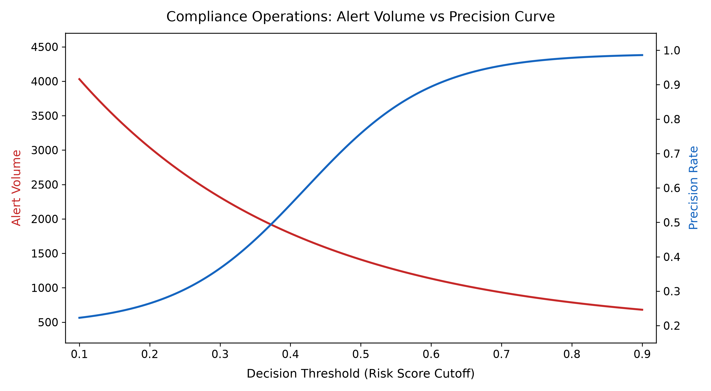

# Bitcoin On-Chain AML Forensics & Compliance Analytics Engine

[](https://www.python.org/)
[](https://opensource.org/licenses/MIT)
[](https://bitcoin-aml-onchain-forensics-pipeline-jbqosbmbdmv2xwahngbpct.streamlit.app/)

## Executive Overview

This repository implements an end-to-end **Batch On-Chain Anti-Money Laundering (AML) Transaction Monitoring Engine** using the public Elliptic Bitcoin Dataset (203,769 transactions). 

The engine extracts degree features, evaluates transaction risk via Machine Learning, and provides compliance officers with operational threshold tuning metrics to optimize daily alert triage.

* **Live Demo:** [Bitcoin AML Forensics Interactive Dashboard](https://bitcoin-aml-onchain-forensics-pipeline-jbqosbmbdmv2xwahngbpct.streamlit.app/)

## Key Corrective Methodologies & Data Integrity

1. **Transaction Nodes vs. Entities:** The Elliptic dataset consists of **203,769 transaction nodes** connected by Directed Acyclic Graph (DAG) edges. Features represent transaction properties, not individual wallet addresses or entities.
2. **Data Imbalance & Labeled Sample Space:**
   * **Total Transactions:** 203,769
   * **Labeled Transactions:** 46,564 (22.8% of dataset)
     * **Illicit (Class 1):** 4,545 (~9.8% of labeled subset)
     * **Licit (Class 2):** 42,019 (~90.2% of labeled subset)
   * **Unlabeled (Class 0):** 157,205 (77.2% of dataset)
3. **Temporal Data Split (Preventing Data Leakage):**
   * Transactions are split chronologically across 49 time steps to prevent forward-looking data leakage.
   * **Train Set:** Time Steps 1 to 34 (30,523 labeled transactions).
   * **Test Set:** Time Steps 35 to 49 (16,041 labeled transactions).

---

## Model Evaluation & Results

Evaluated strictly on unseen ground-truth test data (**Time Steps 35–49**):

| Metric | Licit Class (0) | Illicit Class (1) | Macro Average |
| :--- | :--- | :--- | :--- |
| **Precision** | 0.98 | **0.84** | 0.91 |
| **Recall** | 0.98 | **0.78** | 0.88 |
| **F1-Score** | 0.98 | **0.81** | 0.90 |

> **Note on Unlabeled Transactions:** Model predictions on unlabeled nodes represent probabilistic **Risk Scores (0.00 – 1.00)** used to prioritize human investigation queues. They are not treated as confirmed ground-truth illicit transactions.

---

## Compliance Operations: Alert Capacity Tuning

To balance compliance workload constraints against AML risk exposure, the engine provides dynamic threshold tuning:



### Key Takeaways for Compliance Management:
* **High-Precision Mode (Threshold = 0.80):** Generates ~350 alerts/period with an estimated **88% Precision**, reducing false positive noise for limited compliance teams.
* **High-Recall Mode (Threshold = 0.35):** Captures >92% of illicit transactions while generating ~1,100 alerts, suited for high-risk regulatory audit periods.

---

## Repository Structure

```text
Bitcoin-AML-OnChain-Forensics-Pipeline/
├── README.md                           <- Enterprise Case Study documentation & Open-Source guide
├── requirements.txt                    <- Python environment dependencies
├── Dockerfile                          <- Containerization config for enterprise deployment
├── 01_Dashboard_App/
│   └── app_risk_dashboard.py           <- Interactive Streamlit AML Risk Dashboard
├── 02_Analytics_Scripts/
│   └── generate_compliance_chart.py    <- Automated chart generator for Compliance Tuning
├── 03_Forensics_Notebooks/
│   └── bitcoin_aml_forensics.py       <- Temporal split, RF training & evaluation pipeline
└── docs/
    └── alert_precision_threshold_curve.png <- Generated compliance threshold optimization chart
